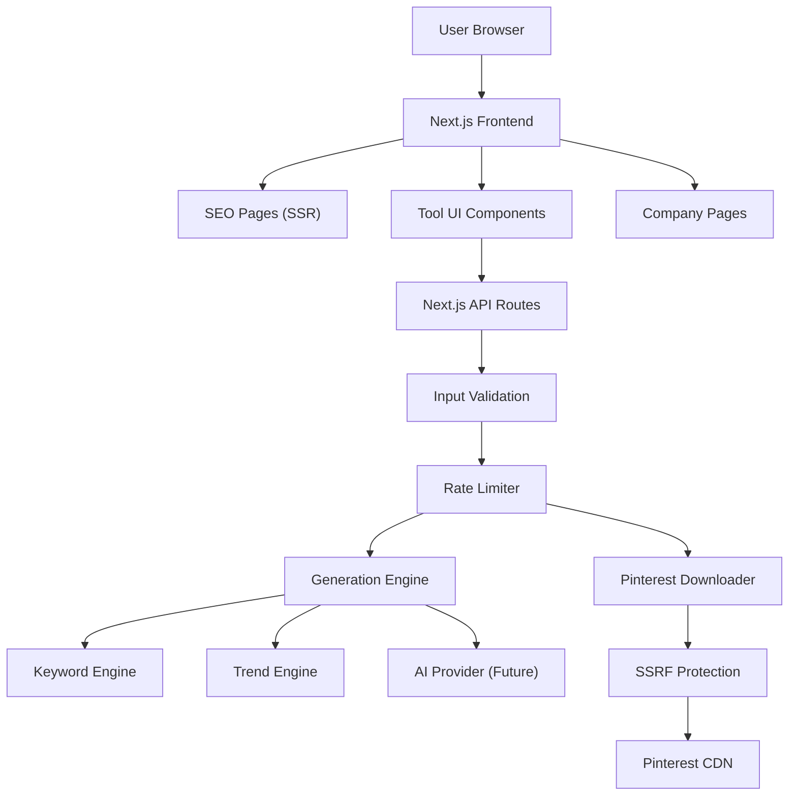

# All-in-One Pinterest SEO & Content Toolkit by SPManchester

Build a production-ready Next.js web application that provides 13 Pinterest SEO and content tools, following the PRD and TRD specifications exactly. The project will be initialized with the provided GitHub repository and deployed to Vercel.

## User Review Required

> [!IMPORTANT]
> **AI Provider**: The TRD specifies AI-powered generation (keywords, titles, descriptions, hashtags, pin ideas). For the MVP, I'll implement a **smart template-based generation engine** that produces high-quality results without requiring an API key. This means all tools work out of the box with no setup. When you're ready to add AI (OpenAI/Gemini), we can swap in a real provider later via the `AI_API_KEY` env var.

> [!IMPORTANT]
> **Database**: Per TRD Section 21, the MVP operates without a database. All tools will work client-side or via server-side route handlers with in-memory caching. Prisma/PostgreSQL schema will be stubbed for future use.

> [!WARNING]
> **Pinterest Downloader**: The downloader tools require server-side fetching of Pinterest page metadata to extract media URLs. This works for publicly accessible pins only. Full SSRF protections will be implemented per TRD Section 12.

---

## Proposed Changes

### Phase 1 — Project Foundation

#### [NEW] Next.js App Initialization

- Initialize Next.js 15 with TypeScript, Tailwind CSS, App Router, ESLint
- Configure `next.config.ts`, `tailwind.config.ts`, `tsconfig.json`
- Set up project structure per TRD Section 3

#### [NEW] [public/logo/spmanchester_logoo.png](file:///c:/Users/lenovo/Desktop/Pinterest/public/logo/spmanchester_logoo.png)
- Copy the provided SPManchester logo into the project

#### [NEW] Design System & Global Styles
- Premium dark-mode-first design with Pinterest-red accents
- Color palette: Dark navy backgrounds, Pinterest red (`#E60023`), SPManchester blue (`#1a3a5c`), white/light text
- Typography: Inter/Outfit from Google Fonts
- Glassmorphism cards, smooth gradients, micro-animations
- Mobile-first responsive breakpoints

---

### Phase 2 — Shared Components

#### [NEW] `components/Header.tsx`
- Responsive header with SPManchester logo, navigation (Tools, Pinterest SEO, Trends, Downloader, Resources, About)
- Mobile hamburger menu with smooth animation

#### [NEW] `components/Footer.tsx`
- 4-column footer: Pinterest Tools, Company, Legal, Social
- "Developed & operated by SPManchester Private Limited Company"
- Social links (Facebook, WhatsApp, LinkedIn, Behance)

#### [NEW] `components/ToolCard.tsx`
- Reusable card for tool listing on homepage with icon, title, description, link

#### [NEW] `components/ToolInput.tsx`
- Reusable keyword/topic input component with validation

#### [NEW] `components/ResultCard.tsx`
- Card displaying generated results with copy functionality

#### [NEW] `components/CopyButton.tsx`
- One-click copy with success feedback animation

#### [NEW] `components/DownloadButton.tsx`
- Download trigger with progress state

#### [NEW] `components/FAQ.tsx`
- Accordion FAQ component with JSON-LD structured data

#### [NEW] `components/Breadcrumbs.tsx`
- SEO breadcrumb navigation with BreadcrumbList schema

#### [NEW] `components/RelatedTools.tsx`
- Internal linking section showing related tool cards

#### [NEW] `components/HowItWorks.tsx`
- Step-by-step section for tool pages

#### [NEW] `components/LoadingState.tsx`
- Animated loading indicators for AI/generation operations

---

### Phase 3 — Data & Library Layer

#### [NEW] `lib/seo.ts`
- SEO metadata generator for all pages (title, description, canonical, OG, Twitter)

#### [NEW] `lib/keywords.ts`
- Keyword generation engine: primary, secondary, long-tail, related, clusters

#### [NEW] `lib/trends.ts`
- Trend analysis and direction detection

#### [NEW] `lib/hashtags.ts`
- Hashtag generation with broad/niche categorization

#### [NEW] `lib/titles.ts`
- SEO-friendly Pinterest title generation with multiple variations

#### [NEW] `lib/descriptions.ts`
- Pinterest description generation with natural keyword placement and CTAs

#### [NEW] `lib/pin-ideas.ts`
- Pin concept, content angle, headline, and CTA generation

#### [NEW] `lib/downloader.ts`
- Pinterest URL parser, media detector, SSRF protection, download handler

#### [NEW] `lib/rate-limit.ts`
- IP-based rate limiting (10 req/hour/IP for anonymous)

#### [NEW] `lib/validation.ts`
- Input validation: keyword length, URL format, content type

#### [NEW] `lib/ai.ts`
- AI provider abstraction (template engine now, swappable for OpenAI/Gemini later)

#### [NEW] `data/tools.ts`
- Tool registry with metadata, URLs, descriptions, icons

#### [NEW] `data/seasonal-trends.ts`
- Seasonal trend data for 12+ seasons/holidays

#### [NEW] `data/faqs.ts`
- FAQ content for each tool page

---

### Phase 4 — API Route Handlers

#### [NEW] `app/api/keywords/route.ts`
- `GET /api/keywords?keyword=...` — Returns keyword suggestions

#### [NEW] `app/api/trends/route.ts`
- `GET /api/trends?keyword=...` — Returns trend data

#### [NEW] `app/api/hashtags/route.ts`
- `POST /api/hashtags` — Generates hashtags from topic

#### [NEW] `app/api/titles/route.ts`
- `POST /api/titles` — Generates SEO pin titles

#### [NEW] `app/api/descriptions/route.ts`
- `POST /api/descriptions` — Generates pin descriptions

#### [NEW] `app/api/pin-ideas/route.ts`
- `POST /api/pin-ideas` — Generates pin content ideas

#### [NEW] `app/api/downloader/route.ts`
- `POST /api/downloader` — Fetches Pinterest media metadata with SSRF protection

---

### Phase 5 — Tool Pages (MVP Phase 1)

Each tool page follows the SEO content template: H1, Intro, Tool UI, How to Use, Benefits, Examples, Tips, Related Tools, FAQ, CTA.

#### [NEW] `app/page.tsx` — Homepage
- Hero with H1, search input, primary/secondary CTAs
- Popular Pinterest Tools grid (8 tool cards)
- How It Works (4 steps)
- Why SPManchester section
- Pinterest SEO Resources
- FAQ section with structured data

#### [NEW] `app/pinterest-seo-keywords/page.tsx`
- Pinterest SEO Keywords Tool — primary, secondary, long-tail, related, clusters

#### [NEW] `app/pinterest-trending-keywords-generator/page.tsx`
- Trending Keywords Generator — trending topic discovery, keyword variations

#### [NEW] `app/pinterest-hashtag-generator/page.tsx`
- Hashtag Generator — broad/niche hashtags, copy individual or sets

#### [NEW] `app/pinterest-title-generator/page.tsx`
- Title Generator — multiple SEO-friendly title variations

#### [NEW] `app/pinterest-description-generator/page.tsx`
- Description Generator — optimized descriptions with CTAs

#### [NEW] `app/pinterest-pin-ideas/page.tsx`
- Pin Ideas Generator — concepts, angles, headlines, visual ideas

---

### Phase 6 — Tool Pages (MVP Phase 2)

#### [NEW] `app/pinterest-trends/page.tsx`
- Trends exploration — trend direction, related topics, seasonal opportunities

#### [NEW] `app/seasonal-pinterest-trends/page.tsx`
- Seasonal trends browser — 12+ seasons with keyword suggestions

#### [NEW] `app/compare-keywords/page.tsx`
- Keyword comparison tool — side-by-side analysis of 2+ keywords

---

### Phase 7 — Downloader Tools (MVP Phase 3)

#### [NEW] `app/pinterest-downloader/page.tsx`
- All-in-One Downloader — auto-detects image/video/GIF

#### [NEW] `app/pinterest-video-downloader/page.tsx`
- Video-specific downloader with quality selection

#### [NEW] `app/pinterest-image-downloader/page.tsx`
- Image downloader with quality options

#### [NEW] `app/pinterest-gif-downloader/page.tsx`
- GIF downloader

---

### Phase 8 — Company & Legal Pages

#### [NEW] `app/about-sp-manchester/page.tsx`
- Company info, services, relationship to toolkit

#### [NEW] `app/contact/page.tsx`
- Contact form, phone, email, address

#### [NEW] `app/privacy-policy/page.tsx`
#### [NEW] `app/terms/page.tsx`
#### [NEW] `app/disclaimer/page.tsx`
#### [NEW] `app/copyright/page.tsx`
#### [NEW] `app/become-a-partner/page.tsx`

---

### Phase 9 — SEO & Infrastructure

#### [NEW] `app/sitemap.ts`
- Dynamic sitemap generation for all public pages

#### [NEW] `app/robots.ts`
- Robots.txt allowing public pages, disallowing `/api/`

#### [NEW] `app/layout.tsx`
- Root layout with Organization JSON-LD, Google Fonts, global metadata

#### [NEW] `.env.example`
- Template for environment variables

#### [NEW] `.github/workflows/ci.yml`
- CI pipeline: TypeScript check, ESLint, build

---

## Architecture Summary



## Verification Plan

### Automated Tests
```bash
npm run lint          # ESLint checks
npx tsc --noEmit     # TypeScript type checking
npm run build         # Production build verification
```

### Manual Verification
- All 13 tool pages render correctly and generate results
- Copy buttons work on all result cards
- Mobile responsive on all pages
- SEO metadata present on all pages (title, description, canonical, OG)
- JSON-LD structured data on homepage and tool pages
- Sitemap accessible at `/sitemap.xml`
- Robots.txt accessible at `/robots.txt`
- Internal linking between related tools
- Rate limiting functional on API routes
- Pinterest downloader handles public URLs
- All company/legal pages render
- Navigation works on mobile and desktop
- Lighthouse scores: Performance 90+, Accessibility 90+, SEO 95+
